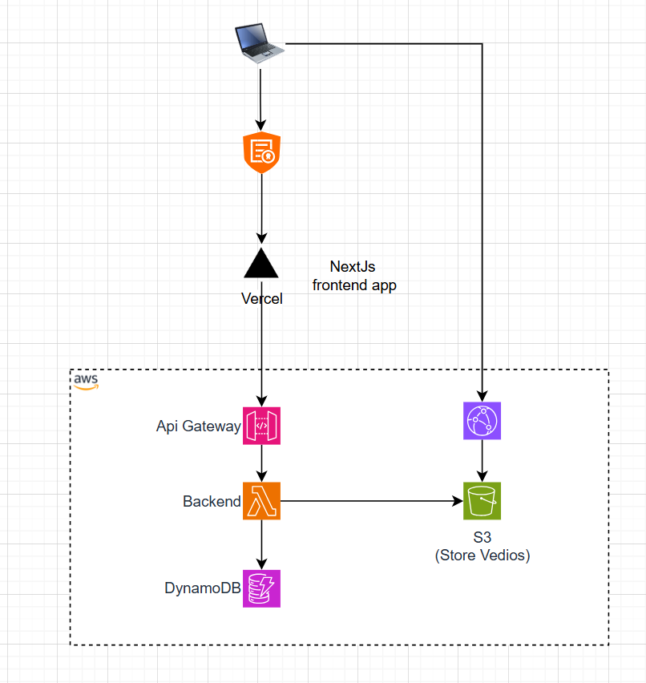

# CognitechX Academy Infrastructure

This directory contains the Terraform infrastructure code for the CognitechX Academy Learning Management System. The infrastructure is designed to be scalable, secure, and cost-effective.



## Overview
### 1. Frontend Application (Next.js on Vercel)
- The user interacts with a Next.js frontend application deployed on Vercel.

- When a user logs in, their authentication and authorization are managed by Clerk, a third-party authentication service.

- If the user is authenticated and authorized, they gain access to the backend services via API Gateway.

### 2. Authentication and Authorization
Clerk handles user authentication and authorization.

Users are categorized into two roles:

- Teachers: Users with a "teacher" flag can create and upload courses.

- Students: Users without the "teacher" flag can only enroll in and watch courses.

### 3. Backend Services (AWS Lambda)
- The backend logic is implemented using AWS Lambda functions, which are serverless compute services.

- These Lambda functions handle various operations such as course creation, enrollment, and video management.

### 4. Course Creation by Teachers
A teacher can create a course by entering course information through the frontend.

The course information is stored in three DynamoDB tables:

- Course Table: Stores course details like title, description, category, teacher information, price, and status.

- User Course Progress Table: Tracks user progress, completion status, and enrollment dates.

- Transaction Table: Records course purchase transactions and payment information.

### 5. Video Upload and Storage
- Teachers can upload course videos to an S3 bucket, which is configured for secure storage.

- The S3 bucket is integrated with CloudFront, a content delivery network (CDN), to distribute videos globally.

- CloudFront ensures optimized video streaming with reduced latency by caching content at edge locations.

### 6. Course Enrollment by Students
- Students can browse available courses and enroll in them.

- Upon enrollment, the transaction is recorded in the Transaction Table, and the student's progress is tracked in the User Course Progress Table.

### 7. Video Streaming for Students
- Enrolled students can watch course videos that are streamed via CloudFront.

- CloudFront ensures efficient delivery of video content, providing a smooth viewing experience with HTTPS encryption for secure data transfer.


## Architecture Description

The infrastructure is built on AWS and consists of the following main components:

### Compute and API Layer
- **AWS Lambda**: Serverless compute service running the Node.js backend
- **API Gateway**: RESTful API interface for the frontend to communicate with Lambda functions
- **IAM Roles**: Managed permissions for Lambda to access other AWS services

### Database Layer
1. **Course Table (DynamoDB)**
   - Primary Key: `courseId`
   - Stores course information including:
     - Title, description, category
     - Teacher information
     - Price and status
     - Sections and chapters structure

2. **User Course Progress Table (DynamoDB)**
   - Composite Key: `userId` (hash) + `courseId` (range)
   - Global Secondary Index: `EnrollmentDateIndex`
   - Tracks:
     - User's progress in each course
     - Completion status of chapters
     - Enrollment dates
     - Quiz scores and achievements

3. **Transaction Table (DynamoDB)**
   - Composite Key: `userId` (hash) + `transactionId` (range)
   - Global Secondary Index for `courseId`
   - Records:
     - Course purchase transactions
     - Payment information
     - Purchase dates
     - Transaction status

### Storage and Content Delivery
- **S3 Bucket**:
  - Stores course videos and other static content
  - Configured with CORS for frontend access
  - Public access controlled via bucket policy
  - Versioning configured for content management

- **CloudFront Distribution**:
  - Global content delivery network
  - Caches and distributes course videos
  - HTTPS enabled with custom SSL certificate
  - Optimized for video streaming
  - Edge locations for reduced latency
  - Custom domain support


## Environment Management

The infrastructure supports multiple environments:
- Development (`dev`)
- Production (`prod`)

Each environment has its own:
- State file in S3
- DynamoDB tables
- Lambda functions
- API Gateway endpoints
- CloudFront distribution

## Infrastructure Modules

The infrastructure is organized into the following modules:

- `api_gateway/`: API Gateway configuration
- `cloudfront/`: CDN setup for video delivery
- `dynamodb/`: Database tables and indexes
- `lambda/`: Serverless function configuration
- `s3/`: Storage bucket setup


## Getting Started

1. Install required tools:
   - Terraform (version 1.0 or later)
   - AWS CLI configured with appropriate credentials

2. Initialize Terraform:
   ```bash
   terraform init
   ```

3. Plan the infrastructure:
   ```bash
   terraform plan
   ```

4. Apply infrastructure:
   ```bash
   terraform apply
   ```

## Important Notes

- The S3 bucket names are globally unique and automatically generated based on account ID and environment
- CloudFront distributions may take up to 30 minutes to deploy
- DynamoDB tables are provisioned with minimal capacity by default
- Lambda functions are configured with environment-specific variables

## Cleanup

To destroy the infrastructure:
```bash
terraform destroy
```

**Note**: This will remove all resources including data in DynamoDB tables and objects in S3 buckets.
